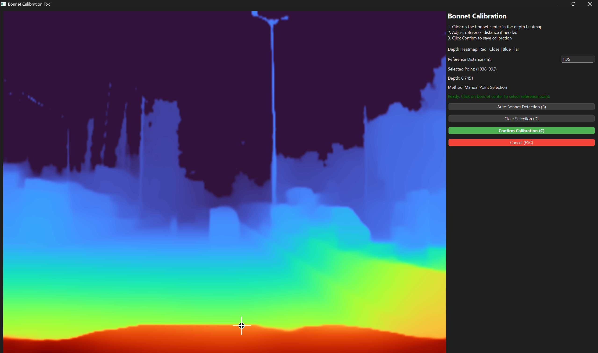

# YOLO + DepthAnything V2: Precise Object Distances Without LiDAR:

A comprehensive system for real-time vehicle detection and distance estimation using a single RGB camera, combining Ultralytics YOLO for object detection with DepthAnything V2 for monocular depth estimation.

## Project Overview:

This project demonstrates how modern deep learning techniques can replace expensive sensors such as LiDAR, stereo cameras, and RGB-D sensors for Advanced Driver Assistance System (ADAS) applications. The system integrates multiple state-of-the-art models to provide accurate distance measurements from a single RGB camera without requiring camera calibration.

### Core Features:

The system provides the following capabilities:

- Real-time vehicle detection using YOLO11 with high accuracy and speed.
- Monocular depth estimation using DepthAnything V2 for pixel-level depth information.
- Multi-object tracking with persistent track IDs using BoTSORT algorithm.
- Bonnet-based calibration for converting relative depth to real-world metric distances.
- Vehicle tracking with appearance-based re-identification using FastReID features.
- Spatial consistency validation to ensure distance measurements are physically plausible.
- Temporal distance smoothing to prevent unstable distance fluctuations between frames.
- Comprehensive visualization with bounding boxes, distance labels, and depth heatmaps.
- Modular architecture designed for easy extension and customization.

## Project Structure:

The project is organized into the following directories and files:

- `config/` - Configuration files including the main YAML configuration.
- `models/` - Model wrapper classes for YOLO detection, depth estimation, distance calculation, bonnet calibration, and vehicle tracking.
- `utils/` - Utility modules for logging, video processing, and visualization.
- `pipeline/` - Main processing pipeline that orchestrates all components.
- `data/` - Centralized storage for models and resources:
  - `data/models/` - YOLO and DepthAnything V2 weights.
  - `data/checkpoints/` - ReID model checkpoints (e.g., VeRiWild .pth files).
  - `data/configs/` - ReID configuration files (e.g., YAML configs for VeRiWild).
- `tests/` - Unit tests for pipeline components.
- `Depth-Anything-V2/` - Cloned DepthAnything V2 repository.
- `main.py` - Entry point for the application.
- `requirements.txt` - Python package dependencies.
- `setup.ps1` - PowerShell setup script for automated environment configuration.

## Quick Start Guide:

### Preferred Setup (PowerShell):

On Windows, use the automated setup script to prepare a clean, isolated environment and folder structure:

```powershell
powershell -ExecutionPolicy Bypass -File .\setup.ps1 -Verbose
```

This will:
- Create and prepare a virtual environment.
- Install requirements and newFastReID.
- Create `data/models`, `data/checkpoints`, `data/configs`, `outputs`, `logs`.
- Copy VeRiWild resources from known locations if available.
- Verify required model files and print next steps.

You can still follow the manual steps below if preferred.

### Environment Setup:

Verify that Python 3.11 is installed and CUDA is available on your system.

```bash
python --version
python -c "import torch; print(torch.cuda.is_available())"
```

### Install Dependencies:

Install all required Python packages from the requirements file.

```bash
pip install -r requirements.txt
```

### Download Model Weights:

Download the DepthAnything V2 model weights using the provided setup script.

```bash
python setup_models.py
```

### Run on Video:

Process a video file with the default configuration.

```bash
python main.py -i "path/to/video.mp4" -o "output_directory"
```

The pipeline generates two output videos:

- `*_standard.mp4` - RGB frame with detections and distances.
- `*_depth_visualization.mp4` - Depth heatmap with detections and distances.

## Configuration:

Edit `config/config.yaml` to customize the pipeline behavior. Key configuration options include:

- Model paths for YOLO, depth estimation, and tracking models.
- Input and output paths for video files.
- YOLO detection parameters including confidence and IOU thresholds.
- Depth estimation model type selection (vits, vitb, vitl, vitg).
- Bonnet calibration settings for metric distance conversion.

## Re-Identification (ReID) with newFastReID:

This project uses the newFastReID library (https://github.com/WhiteMetagross/newFastReID) for appearance-based vehicle re-identification.
- VeRiWild ReID model is used to extract appearance features for each detected vehicle.
- ReID features help maintain consistent track IDs across occlusions and brief frame gaps.
- The tracker combines IoU-based matching with cosine-similarity of ReID features for robust association.

Model and config placement:
- Place VeRiWild checkpoint (.pth) in `data/checkpoints/`.
- Place VeRiWild config (.yml) in `data/configs/`.
- Update `paths.reid_model` and `paths.reid_config` in `config/config.yaml` if using different filenames.

## Temporal Smoothing for Depth Estimation:

To reduce flicker and noise in measured distances, temporal smoothing is applied to the final per-object distance values derived from depth (not to depth maps themselves).
- Smoothing is per-object and keyed by BoTSORT track IDs.
- Uses an exponential moving average (EMA): higher `smoothing_factor` yields more responsiveness, lower yields more stability.
- Configure in `config/config.yaml` under `distance_validation.temporal_smoothing` (enabled, smoothing_factor, window_size).

## How It Works:

### Object Detection:

The system uses YOLO11 to detect vehicles in each frame. The detector returns bounding boxes with confidence scores for each detected object.

### Depth Estimation:

DepthAnything V2 estimates monocular depth for every pixel in the frame. The model provides normalized depth maps that are converted to metric distances using calibration.

### Bonnet-Based Calibration:

The vehicle's bonnet (hood) is detected and used as a reference point at a known distance (default 1.35 meters). This reference is used to convert relative depth values to real-world metric distances. Temporal smoothing over multiple frames ensures stable calibration factors.

#### Interactive Calibration GUI:

Before processing a video, the system opens an interactive PySide6 (Qt6) GUI window for selecting the bonnet reference point:



The interactive calibration interface allows precise selection of the bonnet reference point through a depth heatmap visualization. Users can manually click on the bonnet center or use automatic detection for quick calibration.

**GUI Features:**
- **Depth Heatmap Display** - Shows the depth map with TURBO colormap (red=close, blue=far).
- **Interactive Point Selection** - Click on the heatmap to select the bonnet center.
- **Visual Marker** - Black dot with white outline and crosshair at selected point.
- **Information Panel** - Displays selected coordinates, depth value, and calibration method.
- **Control Buttons** - Auto Bonnet Detection, Clear Selection, Confirm, Cancel.
- **Editable Reference Distance** - Adjust the reference distance value (default 1.35m).

**Keyboard Controls:**
- **Click** - Select bonnet reference point.
- **R** - Edit reference distance (type value, press Enter).
- **B** - Use automatic bonnet detection (center-bottom position).
- **C or Enter** - Confirm calibration and start processing.
- **D or Delete** - Clear current selection.
- **ESC** - Cancel calibration and exit.

**Automatic Bonnet Detection:**
If manual selection is difficult, press **B** to automatically detect the bonnet at the center-bottom position (typical for dash camera views). The system will use this point for calibration.

### Distance Calculation:

Depth values are extracted from bounding box regions and converted to real-world distances in meters. The system validates spatial consistency to ensure nearby objects have similar distances and detects outliers.

### Temporal Distance Smoothing:

To prevent unstable distance fluctuations between frames, the system applies temporal smoothing to the final distance calculations. This feature uses exponential moving average (EMA) to smooth distance values per tracked object:

- **Per-Object Smoothing** - Each tracked object maintains its own smoothing history based on track ID.
- **Exponential Moving Average** - Recent distance measurements are weighted more heavily than older ones.
- **Configurable Parameters** - Smoothing factor (0.0-1.0) and window size control the smoothing strength.
- **Prevents Jitter** - Eliminates sudden distance jumps (e.g., 3.5m → 13m) caused by depth estimation noise.

Configuration options in `config/config.yaml`:

```yaml
distance_validation:
  temporal_smoothing:
    enabled: true
    smoothing_factor: 0.7
    window_size: 5
```

- `enabled` - Enable or disable temporal smoothing.
- `smoothing_factor` - Weight for current measurement (0.7 = 70% current, 30% historical average).
- `window_size` - Number of frames to maintain in history for averaging.

### Multi-Object Tracking:

The BoTSORT algorithm maintains persistent track IDs across frames using motion prediction and appearance-based features. This prevents ID switching even during temporary occlusions.

### Visualization:

The system draws bounding boxes with class labels, distance information, and track IDs on the output frames. Depth maps are visualized using colormaps, and an information panel displays calibration status and processing statistics.

## Output:

The pipeline generates two output videos for each input:

### Standard Video:

The standard output video contains the original RGB frame with detected vehicles, bounding boxes, class labels, and distance measurements in meters. An information panel displays detection count, bonnet detection status, calibration factor, and tracking status.


The standard output shows real-time vehicle detection with bounding boxes, class labels, and distance measurements overlaid on the original RGB frames. Each detected vehicle displays its distance from the camera in meters.

### Depth Visualization Video:

The depth visualization video shows a depth heatmap with overlaid bounding boxes and distance labels. The same information panel is displayed as in the standard video.


The depth visualization output displays the monocular depth estimation as a color heatmap where red indicates closer objects and blue indicates farther objects. Bounding boxes and distance measurements are overlaid on the depth map.

## Performance:

Processing speed varies depending on the selected depth model and enabled features. On an NVIDIA GPU with CUDA 12.1:

- YOLO detection: approximately 30 milliseconds per frame.
- Depth estimation with DepthAnything V2 (vitl): approximately 50 milliseconds per frame.
- Bonnet calibration: approximately 5 milliseconds per frame.
- Distance validation: approximately 10 milliseconds per frame.
- Vehicle tracking without ReID: approximately 10 milliseconds per frame.
- Vehicle tracking with ReID: approximately 100 milliseconds per frame.

Total processing time with all features enabled is approximately 245 milliseconds per frame (4 FPS). Core features only (detection and depth) process at approximately 95 milliseconds per frame (10 FPS).

## Troubleshooting:

### CUDA Not Available:

Verify CUDA installation and ensure PyTorch is built for CUDA 12.1.

```bash
python -c "import torch; print(torch.cuda.is_available())"
pip install torch torchvision torchaudio --index-url https://download.pytorch.org/whl/cu121
```

### Out of Memory:

Reduce memory usage by selecting a smaller depth model (vits instead of vitl), disabling tracking or segmentation, or reducing video resolution.

### Slow Processing:

Use a faster depth model, disable ReID features, disable segmentation, or ensure GPU acceleration is enabled.

### Bonnet Not Detected:

Check bonnet visibility in the video, adjust YOLO confidence threshold, increase temporal smoothing, or review logs in `logs/pipeline.log`.

### Unstable Distance Measurements:

Increase temporal smoothing, enable distance validation, adjust outlier threshold, or verify bonnet detection status.

## Documentation:

Detailed documentation is provided in the following files:

- `README.md` - This file, providing overview and quick start instructions.
- `InstallationAndSetup.md` - Detailed installation and environment setup guide.
- `CodebaseIndex.md` - Technical architecture and API reference.
- `Usage.md` - Usage examples, command-line options, calibration workflow, and outputs.

## References:

- YOLO: https://github.com/ultralytics/ultralytics.
- DepthAnything V2: https://github.com/DepthAnything/Depth-Anything-V2.
- BoTSORT: https://github.com/NirAharon/BoTSORT.

## License:

This project uses multiple open-source components with the following licenses:

- Ultralytics YOLO (AGPL-3.0).
- DepthAnything V2 (Apache 2.0).
- BoTSORT (MIT).

---

For detailed setup instructions, see InstallationAndSetup.md. For technical architecture details, see CodebaseIndex.md.

